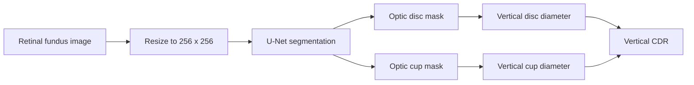

# Glaucoma CDR Estimation with U-Net

[](https://github.com/PranaPragada7/Glaucoma-Cdr-Estimation-Unet/actions/workflows/ci.yml)


A research-oriented computer-vision project that segments the optic disc and
optic cup in retinal fundus images with a U-Net, then estimates the vertical
cup-to-disc ratio (CDR) from the predicted masks.

> **Important:** This project is for education and research. It is not a
> medical device and must not be used to diagnose, screen, or treat patients.

## Pipeline



The packaged implementation separates model construction, image inference,
and CDR measurement so each part can be inspected and tested independently.

## Repository contents

| Path | Purpose |
|---|---|
| `glaucoma_cdr/model.py` | Reconstructs the TensorFlow/Keras U-Net |
| `glaucoma_cdr/inference.py` | Loads an image, runs segmentation, and calculates CDR |
| `glaucoma_cdr/cdr.py` | Validated vertical CDR calculation from binary masks |
| `glaucoma_cdr/cli.py` | Command-line inference entry point |
| `weights/model_weights.h5` | Trained model weights retained from the original project |
| `notebooks/glaucoma_cdr_estimation_unet.ipynb` | Original Colab training and exploration notebook |
| `MODEL_CARD.md` | Model assumptions, provenance, and limitations |
| `tests/` | Unit and model-loading checks |

## Quick start

Use Python 3.10, 3.11, or 3.12. Python 3.11 is used in continuous integration.

```powershell
git clone https://github.com/PranaPragada7/Glaucoma-Cdr-Estimation-Unet.git
cd Glaucoma-Cdr-Estimation-Unet
python -m venv .venv
.\.venv\Scripts\Activate.ps1
python -m pip install --upgrade pip
python -m pip install -r requirements.txt
```

On macOS or Linux, activate the environment with:

```bash
source .venv/bin/activate
```

Run inference on one fundus image:

```powershell
glaucoma-cdr --image path\to\fundus.jpg --output-dir outputs
```

The command writes the predicted disc mask, cup mask, and a JSON summary to
the output directory. The summary includes the measured vertical diameters and
CDR. Generated outputs are excluded from Git.

## Python usage

```python
from glaucoma_cdr.inference import infer_image

result = infer_image("path/to/fundus.jpg")
print(f"Vertical CDR: {result.cdr.ratio:.3f}")
```

For already-segmented masks, use the measurement module directly:

```python
from glaucoma_cdr.cdr import estimate_vertical_cdr

measurement = estimate_vertical_cdr(disc_mask, cup_mask)
print(measurement.ratio)
```

## Model and preprocessing notes

- Input shape: `256 x 256 x 3` RGB image.
- Output shape: `256 x 256 x 3` sigmoid probabilities.
- Channel 0 is treated as the optic disc and channel 1 as the optic cup.
- The original notebook trained on resized RGB values without dividing by
  255, so the inference path preserves that preprocessing by default.
- Binary masks use a configurable probability threshold, defaulting to `0.5`.
- CDR is calculated from vertical mask extent, not the farthest Euclidean
  contour points used in the legacy notebook.

The included weights have SHA-256 checksum:

```text
907da603a355ce7d52e80c30337ef3f8a77f49add1e5d2cfc084087c7b2bd7cc
```

## Dataset and notebook

The original notebook references the ORIGA retinal fundus dataset through
private Google Drive paths. The dataset is not redistributed here. To retrain
the model, obtain the dataset through an authorized source, follow its license
and usage terms, and replace the notebook paths with your local dataset paths.

The notebook is retained as an experiment record, not as the supported entry
point. See [`notebooks/README.md`](notebooks/README.md) before running it.

## Validation

Install development dependencies and run the repository checks:

```powershell
python -m pip install -r requirements-dev.txt
python -m black --check .
python -m pytest -q
```

The tests cover mask validation, vertical CDR calculation, U-Net output shape,
and compatibility with the committed weight file. No clinical performance
claim is made because the repository does not contain a reproducible held-out
evaluation dataset or an auditable metric report.

## Limitations

- CDR is only as reliable as the predicted segmentation masks.
- Image quality, camera characteristics, retinal pathology, and domain shift
  can substantially affect predictions.
- The cup mask is expected to lie inside the disc mask.
- CDR alone is insufficient for a glaucoma diagnosis.
- The original training split and reported notebook outputs have not been
  independently reproduced in this repository.

See [`MODEL_CARD.md`](MODEL_CARD.md) for the full intended-use and limitation
statement.

## References

- Ronneberger, Fischer, and Brox, [*U-Net: Convolutional Networks for
  Biomedical Image Segmentation*](https://arxiv.org/abs/1505.04597), 2015.
- Zhang et al., [*ORIGA(-light): an online retinal fundus image database for
  glaucoma analysis and research*](https://pubmed.ncbi.nlm.nih.gov/21095735/),
  2010. DOI: `10.1109/IEMBS.2010.5626137`.
- Garway-Heath et al., [*Vertical cup/disc ratio in relation to optic disc
  size*](https://pmc.ncbi.nlm.nih.gov/articles/PMC1722393/), 1998.
